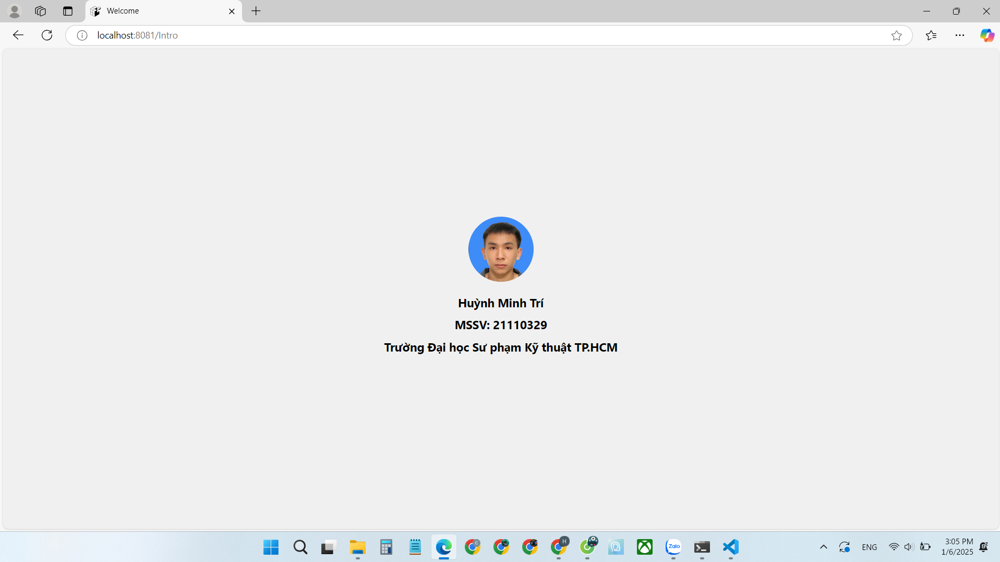
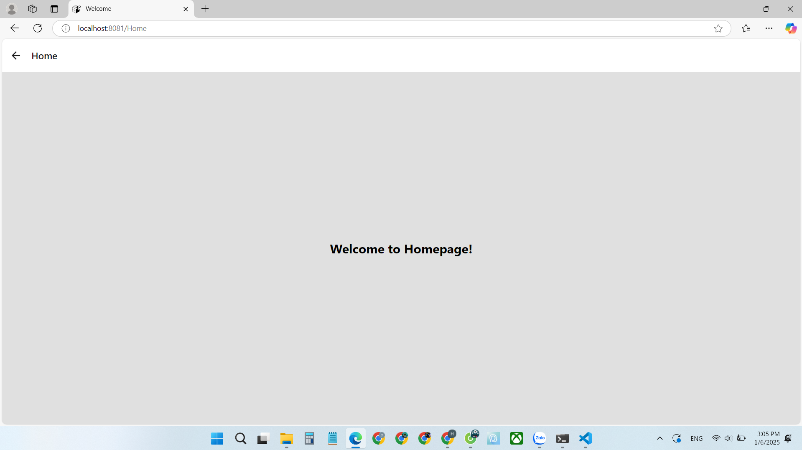

Bài tập 01: (06/01/2025) Cài đặt môi trường lập trình

Yêu cầu: Sinh viên xem hướng dẫn cài đặt môi trường trên trang chủ của ReactNative (https://reactnative.dev) nếu làm về ReactNative tiến hành cài đặt môi trường làm việc.

Sau đó làm bài tập 01: viết 01 app với 02 trang: trang giới thiệu bản thân trong 10s sau đó tự chuyển sang trang Homepage.

Kết quả:

